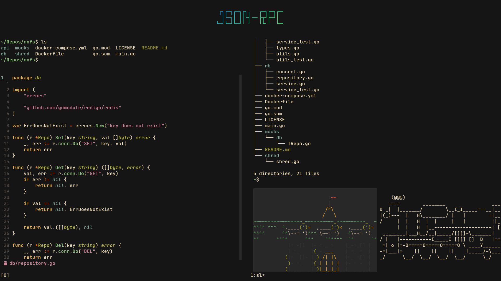

```
   ____   ___ _____ _____ ___ _     _____ ____
  |  _ \ / _ \_   _|  ___|_ _| |   | ____/ ___|
  | | | | | | || | | |_   | || |   |  _| \___ \
 _| |_| | |_| || | |  _|  | || |___| |___ ___) |
(_)____/ \___/ |_| |_|   |___|_____|_____|____/

```
This is a repository for all my configuration files. My setup aims to be minimal while being pleasing to the eye and functional.

| Software             |                                                                                |
|----------------------|--------------------------------------------------------------------------------|
| Linux Distribution   | Arch                                                                           |
| Window manager       | Devoidwm                                                                       |
| Terminal emulator    | Alacritty                                                                      |
| Terminal font        | JetBrains Mono Nerd Font                                                       |
| Terminal multiplexer | Tmux                                                                           |
| Shell                | BASH                                                                           |
| /bin/sh ->           | dash                                                                           |
| text editor          | neovim                                                                         |
| RSS reader           | newsboat                                                                       |
| Email client         | neomutt                                                                        |
| Video player         | mpv                                                                            |
| Document reader      | zathura                                                                        |
| Image viewer         | sxiv                                                                           |
| screen locker        | slock                                                                          |
| password manager     | pass (pass-otp for 2FA)                                                        |


